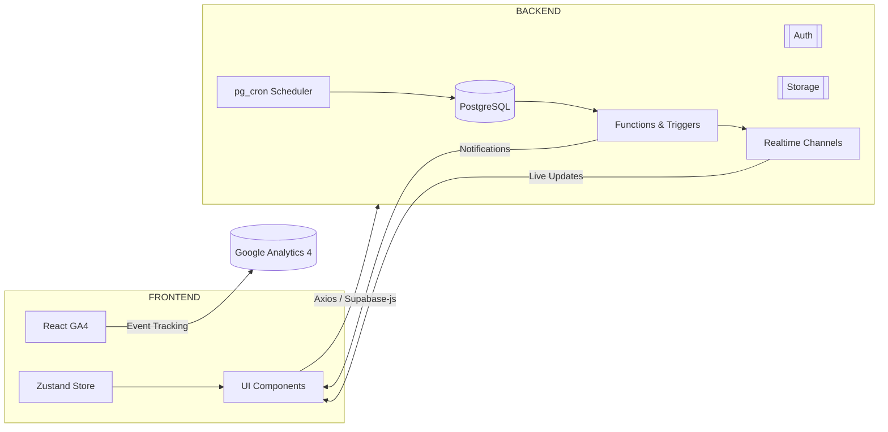

 
 

**개발 기간:** 2025.08.25 ~ 2025.11.13 (최종 발표일) **참여 인원:** 4명

[배포링크 Mo:ri](https://mo-ri.vercel.app/) | [Notion 주소](https://www.notion.so/Project-Mo-ri-25a0edcd88c380db8484d6caa1570c9e) | [Figma 최종본] |(https://www.figma.com/design/CgxgjkbirRbyFVGUSDPoG0/?node-id=0-1)
| [Canva 최종 발표 PPT](https://www.canva.com/design/DAG3nu7OiWE/YM6avpjq1eqbP-VbGa7lpQ/edit)

---

## 프로젝트 개요

### 서비스 목표

- 시중의 모임 플랫폼은 친목 위주라 자기계발 목적의 모임이 부족함.
- Mori는 자기계발 중심의 스터디·원데이클래스 중심 커뮤니티로,
  - 활동 인증과 후기 기록을 통해 **자기 성장과 커리어 기록**을 남기고,
  - 나아가 **취업 포트폴리오로 활용 가능한 활동 이력**을 제공하는 것을 목표로 함.

---

## 주요 타깃

- 20~30대 직장인, 대학생, 프리랜서
- 취미/네트워킹/스터디/운동 등 자기계발 중심의 모임을 원하는 사용자

---

## 핵심 기능

| 구분      | 기능명                            | 설명                                       |
| --------- | --------------------------------- | ------------------------------------------ |
| 회원      | 회원가입 / 로그인 (Supabase Auth) | 이메일 인증 및 자동 세션 유지              |
| 모임      | 생성 / 수정 / 삭제 / 참여         | 호스트 전용 권한, RLS 기반 권한 관리       |
| 일정      | 일정 등록 / D-Day 계산 / 캘린더   | FullCalendar + dayjs 기반 UI               |
| 채팅      | 1:1 / 그룹채팅                    | Supabase Realtime 기반 실시간 통신         |
| 알림      | 실시간 알림 시스템                | 트리거 + Realtime + pg_cron 으로 자동화    |
| 문의      | 문의 등록 및 관리자 알림          | 트리거로 관리자에게 알림 자동 전송         |
| 찜/리뷰   | 좋아요 / 후기 / 찜 기능           | 활동 기반 랭킹, 포인트 시스템 구축         |
| 통계/분석 | 사용자 행동 분석                  | React GA4 (Google Analytics 4) 기반 트래킹 |

> 모든 주요 기능은 **Supabase Realtime, RLS, Function, Trigger, pg_cron** 을 활용한 서버리스 백엔드로 구현

---

## 기술 스택

### Frontend

- React 18 (Vite + TypeScript)
- Context API
- React Router v6
- TailwindCSS
- Framer Motion (애니메이션)
- React Hook Form
- Swiper, Ant Design
- React Quill, React Calendar, html2pdf.js
- **React GA4 (Google Analytics 4) — 사용자 행동 및 전환 추적**

### Backend / Infra

- Supabase (PostgreSQL + Auth + Storage + RLS)
- Supabase Realtime (채팅, 알림 구독, 그룹)
- Functions & Triggers (알림, 문의 자동화)
- pg_cron (자동 스케줄 관리)
- Supabase CLI + 자동 타입 생성 (`npm run generate-types`)
- SQL 기반 RLS 정책 및 Enum 설계

### Tools

- Git / GitHub / Vercel (배포)
- Notion / Figma / ERD Cloud (기획·디자인·DB 설계)
- Canva (발표 자료)

---

## System Architecture (시스템 아키텍처)

---

## Mo:ri 메인 로직 플로우차트

### 주요 기능 플로우

#### 1. 모임 생성 → 관리자 승인 → 알림 발송

- 사용자가 모임 생성 시 status = pending
- 관리자가 승인 시 pg_cron으로 일정 자동 갱신
- 승인 알림이 실시간으로 사용자에게 전달

#### 2. 1:1 채팅

- direct_chats, direct_messages 테이블 기반
- Realtime으로 메시지 자동 구독 / 읽음 처리
- RLS 정책으로 참여자만 접근 가능

#### 3. 문의 등록

- 사용자가 문의 등록 시 notify_inquiry_created 트리거 실행
- 관리자에게 알림 자동 생성 (inquiry_new 타입)

#### 4. 사용자 행동 추적 (GA4)

- React GA4로 페이지별 이벤트 추적
- login, group_create, group_join, inquiry_submit
- 분석 데이터를 통해 UI 개선 및 유지율 향상

## Mo:ri 메인 로직 다이어그램

---

## Troubleshooting Cases (트러블슈팅 사례)

### 1. 문의 등록 실패 (HTTP 400 Bad Request)

**문제 상황**

- 사용자가 문의를 등록할 때, Supabase REST 요청이 400 오류를 반환하며 실패함.
- 콘솔 로그에는 `POST /user_inquiries 400 (Bad Request)` 메시지가 출력됨.

**원인 분석**

- 트리거 함수 `notify_inquiry_created()`가 `SECURITY INVOKER` 로 설정되어 있었음.
- 일반 사용자가 INSERT를 실행할 때, 트리거 내부에서 관리자에게 알림을 보내는 `create_notification()` 호출이 권한 부족으로 차단됨.

**해결 방법**

- 트리거 함수를 `SECURITY DEFINER`로 변경하여 서비스 역할로 실행되도록 수정.
- 함수 내부에서 `SELECT user_id FROM user_profiles WHERE is_admin = TRUE LIMIT 1;` 로 관리자 계정을 안전하게 조회하도록 보완.

**결과**

- 모든 사용자 문의 등록 시 알림이 정상 생성되고, 관리자 화면에 “새로운 문의 등록” 알림 표시됨.

---

### 2. 알림 중복 발생 (Realtime 중복 구독)

**문제 상황**

- 동일 알림이 2~3회씩 중복 표시되는 현상 발생.
- 새로고침 후에도 동일 이벤트가 계속 트리거됨.

**원인 분석**

- 컴포넌트가 리렌더링될 때마다 Supabase `channel.subscribe()`가 중복 등록되고 있었음.
- useEffect 의존성 미설정 및 cleanup 누락으로 인해 구독 해제가 되지 않음.

**해결 방법**

- useRef를 사용해 구독 여부를 추적하고, 이미 구독된 경우 재등록을 방지.
- cleanup 함수(`return () => channel.unsubscribe()`)를 추가하여 구독 중복 해제.

**결과**

- 실시간 알림 중복 문제 완전히 해결, 성능 부하 및 UI 오류 개선.

---

### 3. 모임 자동 종료 스케줄 미작동 (pg_cron)

**문제 상황**

- `pg_cron`을 이용한 “만료된 모임 자동 종료” 기능이 실행되지 않음.
- `groups` 테이블의 상태값(`status`)이 일정이 지나도 `active`로 유지됨.

**원인 분석**

- Supabase Dashboard의 pg_cron 확장 설정은 되어 있었지만,  
  서비스 역할(Service Role)이 해당 스케줄 작업 실행 권한을 가지고 있지 않았음.

**해결 방법**

- Supabase SQL Editor에서 `grant usage on schema cron to service_role;` 실행.
- `cron.schedule` 함수의 실행 주체를 service role로 수정.
- 테스트용 수동 트리거(`SELECT cron.schedule(...)`)로 검증 후 정상 동작 확인.

**결과**

- 매일 새벽 만료된 모임이 자동 종료되고, “모임 종료 알림”이 사용자에게 자동 전송됨.

---

### 4. GA4 이벤트 누락

**문제 상황**

- GA4에 일부 페이지 이동 및 버튼 클릭 이벤트가 수집되지 않음.
- 특정 라우터 변경 시 트래킹이 누락되어 통계 데이터 불완전.

**원인 분석**

- React Router의 클라이언트 사이드 라우팅 구조에서 GA4 기본 `pageview` 이벤트가 실행되지 않음.
- GA 초기화 시점이 App 진입 이후로 지연되어 최초 이벤트 손실 발생.

**해결 방법**

- `useEffect`로 라우트 변경 시 `ReactGA.send({ page: location.pathname })` 호출 추가.
- 초기화 시점에서 `ReactGA.initialize()`를 App 최초 렌더링 시 즉시 실행하도록 수정.

**결과**

- 모든 페이지 이동 및 주요 액션 클릭이 정상적으로 수집되고,  
  GA4 대시보드에서 페이지별 세션·유입률·전환율 데이터를 확인 가능.

---

## 성과 및 배운 점

- Supabase의 **RLS, Trigger, Function, pg_cron**을 통합해 백엔드 없이도 완전한 서버리스 구조 구현
- 실시간 채팅과 알림 시스템을 결합하여 **즉각적인 반응형 UX** 구현
- **React GA4**를 통해 사용자 행동 데이터를 수집, UI 개선과 마케팅 성과를 데이터 기반으로 측정
- RLS 및 보안 정책 설계 과정을 통해 **PostgreSQL 권한 구조**와 **트리거 동작 메커니즘**을 심도 있게 학습
- Realtime 구독 및 트리거 충돌 문제를 해결하며 **비동기 로직 디버깅 경험** 축적
- 전체 프로젝트를 **기획 → 설계 → 구현 → 배포**까지 수행하며, 협업 프로세스와 버전 관리의 중요성을 체득

---

## 협업 규칙

- **Branch 전략**
  - 기능 단위 브랜치 생성 후 PR 진행 (main 직접 커밋 금지)
  - PR 시 담당 기능 및 변경 요약 필수 기재 (`[feat]`, `[fix]`, `[docs]` 등 prefix 사용)

- **코드 관리**
  - 컴포넌트 단위로 분리, 재사용 가능한 구조로 유지
  - console.log 등 디버그 코드 제거
  - 공통 컴포넌트는 `/common` 폴더 내 관리
  - ESLint 및 Prettier를 통한 코드 스타일 일관성 유지

- **개발 프로세스**
  - 기획 → 피그마 → DB 설계 → UI 구현 → 기능 구현 순으로 진행
  - Supabase 스키마 변경 시 `npm run generate-types` 실행 필수
  - 배포 전 로컬 테스트 및 Vercel Preview 검증 필수

---

## 향후 개선 방향

- 관리자 전용 **통계 대시보드 시각화** (모임 수, 사용자 수, 방문자 데이터)
- 알림 **그룹화 및 Lazy Subscription 최적화**
- **추천 알고리즘** 고도화 (사용자 선호 기반 모임 추천)
- 채팅 **이미지 업로드 및 파일 전송 기능 추가**
- **GA4 이벤트 세분화** 및 세그먼트 분석으로 사용자 리텐션 강화
- pg_cron 기반 **정기 리포트 메일 발송 기능** 추가
- Supabase Function 캐싱 최적화 및 트리거 로깅 기능 확장

---

**유지선** [GitHub](https://github.com/maintainline) | [Notion](https://www.notion.so/Project-Mo-ri-25a0edcd88c380db8484d6caa1570c9e) | [E-mail](z.seon.dev@gmail.com)
**여채현** [GitHub](https://github.com/yachea) | [Notion](https://fair-mimosa-69b.notion.site/PORTFOLIO-2159f76bdabf80749634c22385d20760?pvs=74) | [E-mail](dev.yachea@gmail.com)
**문유비** [GitHub](https://github.com/devyubi) | [Notion](https://www.notion.so/MO-ri-2a0d08a49cc3802583e2ff9b75da2d0b) | [E-mail](dev.munyubi@gmail.com)
**송병근** [GitHub](https://github.com/sbk283) [Notion](https://sbk283.notion.site/21e3d0ff490f8040a16aff595156eb95?source=copy_link) | [E-mail](sbk283@naver.com)
